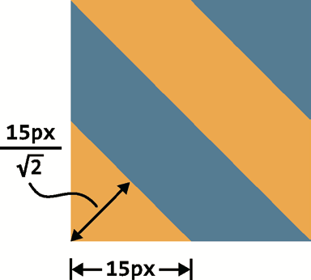

# cssSecret
# 简介

### 由于水平有限，编写的过程难免会有诸多错误，也希望大家在看的过程中发现了问题，可以在 Github 上给该项目发 Pull Request。衷心希望可以有更多的人参与到本书的编写当中

## 检测原理
如果要检测选择符和 @ 规则的支持情况,则会稍稍复杂一些。不过原 理也很简单,在解析 CSS 代码时,浏览器总会丢弃它自己无法识别的部分, 
因此我们可以动态地应用样式并检查它是否生效,以此来判断浏览器是否可 以识别某个特性。
当然,我们也要清楚地认识到,浏览器可以解析某个 CSS 特性并不代表它已经实现(或正确实现)了这个特性。
### 检测某个样式`属性`是否被支持 思路: 任一元素的element.style上是否有该属性
```javascript
var root = document.documentElement; // <html>
if ('textShadow' in root.style) { 
    root.classList.add('textshadow');
} else {
    root.classList.add('no-textshadow');
}

function testProperty(property) {
    var root = document.documentElement;
    if (property in root.style) {
        root.classList.add(property.toLowerCase()); 
        return true;
    }
    root.classList.add('no-' + property.toLowerCase());
    return false; 
}
```

### 检测某个`具体属性值`是否支持 把值赋给某个对应的属性, 然后检查浏览器是否海保存这个值
```javascript
function testValue(id, value, property) { 
    var dummy = document.createElement('p'); 
    var root = document.documentElement; //p29 issues
    dummy.style[property] = value;
     if (dummy.style[property]) { 
        root.classList.add(id); 
        return true;
     }
     root.classList.add('no-' + id);
     return false; 
     }
```

## CSS3规范
 * CSS [语法](http://w3.org/TR/css-syntax-3)
 * CSS [层叠与继承](http://w3.org/TR/css-cascade-3)
 * CSS [颜色](http://w3.org/TR/css3-color)
 * [选择符](http://w3.org/TR/selectors)
 * CSS [背景与边框](http://w3.org/TR/css3-background) 
 * CSS [值与单位](http://w3.org/TR/css-values-3)
 * CSS [文本排版](http://w3.org/TR/css-text-3)
 * CSS [文本装饰效果](http://w3.org/TR/css-text-decor-3) 
 * CSS [字体](http://w3.org/TR/css3-fonts)
 * CSS [基本 UI 特性](http://w3.org/TR/css3-ui)
 此外,如果某个模块是前所未有的新概念,那它的版本号将从 1 开始。 比如下面这些:
 * CSS [变形](http://w3.org/TR/css-transforms-1)
 * [图像混合效果](http://w3.org/TR/compositing-1) 
 * [滤镜效果](http://w3.org/TR/filter-effects-1)
 * CSS [遮罩](http://w3.org/TR/css-masking-1)
 * CSS [伸缩盒布局](http://w3.org/TR/css-flexbox-1) 
 * CSS 网格布局(http://w3.org/TR/css-grid-1)
 尽管“CSS3”这个名词非常流行,但它实际上并没有在任何规范中定 义过。这一点跟 CSS 2.1 或更早的 CSS 1 不一样。真正的情况是,绝大多
 
 ### 灵活的按钮
 * 按钮1
 ```
 padding: .3em .8em;
 border: 1px solid #446d88;
 background: #58a linear-gradient(#77a0bb, #58a); 
 border-radius: .2em;
 box-shadow: 0 .05em .25em gray;
 color: white;
 text-shadow: 0 -.05em .05em #335166;
 font-size: 125%;
 line-height: 1.5;
 ```
 缺点: 要根据按钮的亮面和暗面相对于主色调   #58a 变亮和变暗的程度来分别推 导出其他颜色各自的亮色和暗色版本。
 此外,若我们想把按钮放在一个非白 色的背景之上呢?显然使用灰色( gray)作投影只适用于纯白背景的情 况。
 
 *改良的灵活的按钮
 **半透明的黑色或白色叠加在主色调上,即可产生主色调的亮 色和暗色变体,**
 // 推 荐 使 用 HSLA 而 不 是 RGBA 来产生半透明的白色,因 为它的字符长度更短,敲起来也 更快。这归功于它的重复度更低
 ```
 padding: .3em .8em;
 border: 1px solid rgba(0,0,0,.1);
 background: #58a linear-gradient(hsla(0,0%,100%,.2),
                                  transparent);
 border-radius: .2em;
 box-shadow: 0 .05em .25em rgba(0,0,0,.5); 
 color: white;
 text-shadow: 0 -.05em .05em rgba(0,0,0,.5);
 font-size: 125%; 
 line-height: 1.5;
 
 
 button.cancel { background-color: #c00;
 }
 button.ok { background-color: #6b0;
 }
 ```
 
 ### baseline理解 vertical-align默认是基线对齐
  参考 (https://www.cnblogs.com/xuhaodong/p/basseline.html)
  
 ### 代码易维护(改动尽可能少)
 ```
 border-width: 10px 10px 10px 0;
 ```
 使用下面的代码 border-width变啦只需改一个地方
 ``` 
 border:10px
 border-left-width:0px
 ```
 
 ###  currentColor  css史上第一个变量
 未来,我们在原生 CSS 中拥有处理颜色的函数后,currentColor 就会 变得更加有用,因为我们可以用这些函数来产生其各种深浅明暗的变体。

 ### 提示框上的倒三角
 ```
  .callout:before{
             content: "";
             position: absolute;
             top: -.45em;
             left: 1em;
             padding: 0.35em;
             background: inherit;
             border: inherit;
             border-right: 0;
             border-bottom: 0;
             transform: rotate(45deg);
         }
 ```
 
 ### 视觉上的错觉 p42
 * 对完美垂直居中的布局看着偏上
 * 同宽同高的圆比 正方形看着小
 * 文字边距设一样 上下看着边距比左右更大
 
 ### 媒体查询的断点不应该🈶️具体的设备来决定 应根据设计自身决定
 及pc端以任意尺寸的窗口来显示都能很好的显示
     *使用百分比或视口相关的单位(视口宽度或高度的百分比) (vw vh vmin vmax) 
     [参考](https://blog.csdn.net/ZNYSYS520/article/details/76053961)
     
 ### 自适应布局原则
 遵从“尽量减少代码重复”所描述的原则对此也是有帮助的,因为你不 需要去覆盖媒体查询里同样数量的声明。这在本质上减轻了它们所产生的维 护成本。
 下面还有一些建议,可能会帮你避免不必要的媒体查询。
 „ * 使用百分比长度来取代固定长度。如果实在做不到这一点,也应该 尝试使用与视口相关的单位(vw、vh、vmin 和 vmax),它们的值解 析为视口宽度或高度的百分比。
 „ * 当你需要在较大分辨率下得到固定宽度时,使用 max-width 而不是 width,因为它可以适应较小的分辨率,而无需使用媒体查询。
 „ * 不要忘记为替换元素(比如 img、object、video、iframe 等)设 置一个 max-width,值为 100%。
 „ * 假如背景图片需要完整地铺满一个容器,不管容器的尺寸如何变化, background-size: cover 这个属性都可以做到。但是,我们也要时 刻牢记——带宽并不是无限的,因此在移动网页中通过 CSS 把一张 大图缩小显示往往是不太明智的。
 „ * 当图片(或其他元素)以行列式进行布局时,让视口的宽度来决定 列的数量。弹性盒布局(即 Flexbox)或者 display: inline-block 加上常规的文本折行行为,都可以实现这一点。
 „ * 在使用多列文本时,指定column-width(列宽)而不是指定 column-count(列数),这样它就可以在较小的屏幕上自动显示为单 列布局。
 
 ### 抽象泄漏法则
    css预处理器自己有不为人知的bug
    
 ### CSS 的原生变量(--accent-color11)所具备的动态性 
 http://www.myth.io/ 偏原生的css预处理器
 
         ul { --accent-color11: yellow; }
         ol { --accent-color11: red; }
         li { background: var(--accent-color11); }
         
  ### 半透明边框实现border
   **默认情况下 背景色会延伸到边框所在的区域下层**
   以下透明未起作用, 是因为我们没有让body的背景从半透明白色边框初透出来,
   而是半透明白色边框处透出啦这个容器自己的绿色背景 
   (background: white; 跟纯白实色的边框看起来效果一样)
   ```
   border: 10px dotted hsla(0,0%,100%,.5); 
   background: green;
   ```
   **
   在 CSS 2.1 中,这就是背景的工作原理。我们只能接受它并且向前看。 谢天谢地,从背景与边框(第三版)(http://w3.org/TR/css3-background)开 始,
   我们可以通过 background-clip 属性来调整上述默认行为所带来的不 便。这个属性的初始值是 border-box,意味着背景会被元素的 border box
   (边框的外沿框)裁切掉。如果不希望背景侵入边框所在的范围,我们要做 的就是把它的值设为 padding-box,这样浏览器就会用内边距的外沿来把背 景裁切掉。
   **
   ```
   border: 10px dotted hsla(0,0%,100%,.5); 
   background: green;
   background-clip: padding-box;
   ```
   
   ### 多重边框 box-shadow border.html
   **box-shadow 的好处在于,它支持逗号分隔语法,我们 可以创建任意数量的投影box-shadow 是层层叠加的,第一层投影位于最顶 层,依次类推。
   因此,你需要按此规律调整扩张半径。比如说,在前面的代 码中,我们想在外圈再加一道 5px 的外框,那就需要指定扩张半径的值为 15px(10px+5px)。
   如果你愿意,甚至还可以在这些“边框”的底下再加一 层常规的投影:**
   background: yellowgreen;
   box-shadow: 0 0 0 10px #655, 0 0 0 15px deeppink;
   
   ### 二层边框 outline border.html
   **两层边框,那就可以先设置一层常规边 框,再加上 outline(描边)属性来产生外层的边框。这种方法的一大优 点在于边框样式十分灵活,不像上面的 box-shadow 方案只能模拟实线边框
     (假设我们需要产生虚线边框效果,box-shadow 就没辙了)**
     
   ### 斜向条纹
   
   ```
       background: linear-gradient( 45deg, red 33.3%, black 0, black 66.6%, yellow 0);
       background: linear-gradient(45deg, #fb3 25%, #58a 0 , #58a 50%, #fb3 0, #fb3 75%, #58a 0);
       background-size:30px 30px;
       /*斜向条纹的宽度是15(根号2-1) */
   ```
   
   ### 灵活的斜向条纹
   ```
       background: repeating-linear-gradient(60deg, #fb3, #fb3 15px, #58a 0, #58a 30px);
       /*这边长度直接代表了自身的长度 不需要计算 15(根号2-1)*/
       /*可以随心所欲的改变角度*/
       /* background-size:30px 30px;*/
   ```
   
   ### 灵活的同色系条纹 
   把最深的颜色指定为背景色 同时把半透明白色的条纹叠加在背景色之上来得到浅色条纹
   ```
       .flexible-repeat-diagnoal-strips{
               background:#58a;
               background-image: repeating-linear-gradient(60deg, hsla(0, 0%, 100%, 0.1), hsla(0, 0%, 100%, 0.1) 15px, transparent 0, transparent 30px);
           }
   ```
   ### chp6复杂背景图
   网格: 线性渐变 linear-gradient
   波点: 径向渐变  radial-gradient (允许我们创建圆形 椭圆 径向渐变能创建的最简单的图案是圆点的阵列)
   ```
   @mixin polka($size, $dot, $base, $accent) { SCSS background: $base;
   background-image:
   radial-gradient($accent $dot, transparent 0),
   radial-gradient($accent $dot, transparent 0); background-size: $size $size; background-position: 0 0, $size/2 $size/2;
   }
   @include polka(30px, 30%, #655, tan);
   SCSS
   ```
   ### 角向渐变 p70 ### 
   
   ### svg代码可以以data URI的方式内嵌到样式表 chp6/conicgradient###
   ```
         .chess-svg{
               width:100vw;
               height:30vh;
               margin:10px;
               background: #eee url('data:image/svg+xml,<svg xmlns="http://www.w3.org/2000/svg" width="100" height="100" fill-opacity="0.25">\
               <rect x="50" width="50" height="50"></rect>\
               <rect y="50" width="50" height="50"></rect>\
               </svg>');
               background-size:30px 30px;
           }
   ```
   
   ### 蝉原则 多个时长为质数的动画 创造出看起不是按照明显的规律循环的动画 chp6/cicada-animation.html
   
   ### 蚂蚁行军图, 脚注  chp8/border-image.html### 
   
   ### 自适应椭圆 ###
   border-radius 超过50%都是一半的效果
   当任意两个相邻圆角的半径之和超过border box的尺寸时 , 用户代理必须按比例减小个边框半径所使用的值 直到她们不会相互重叠
   http://w3.org/TR/css3- background/#corner-overlap
   
   ### 半椭圆 ### 
   „ *** 这个形状是垂直对称的,这意味着左上角和右上角的半径值应该是 相同的;与此类似,左下角和右下角的半径值也应该是相同的。
   „ *** 顶部边缘并没有平直的部分(也就是说,整个顶边都是曲线),这意 味着左上角和右上角的半径之和应该等于整个形状的宽度。
   
   半椭圆是可以变成半圆的,只要它的宽度刚好伸展到高度的两倍(或者对一个沿纵轴劈开的 椭圆来说,是高度伸展为宽度的两倍)。
   ```
       width: 200px;
       height: 100px;
       border-radius: 50% / 100% 100% 0 0;
   }
   ```
   „ 基于前两条观察,我们可以推断出,左半径和右半径在水平方向上的值应该均为 50%。
   „ 再看看垂直方向,似乎顶部的两个圆角占据了整个元素的高度,而且底部完全没有任何圆角。因此,在垂直方向上 border-radius 的 合理值似乎就是 100% 100% 0 0。
   „ 因为底部两个角的垂直圆角是零,那么它们的水平圆角是多少就完全不重要了,因为此时水平圆角总是会被计算为零。(你能想像一个 垂直半径为零而水平半径为正值的圆角吗?没错,连写规范的作者 们都做不到。)
   
   ### 按钮集 ### 
   http://simurai.com/archive/buttons/#
   
   ###平行四边形 chp10 skew p88###
   
   如果你想把这个效果应用到 一个默认显示为行内(transform)的元素,不
   要忘记把它的 display 属性设置 为 其 他 值, 比 如 inline-block 或 block,否则变形(transform)是不会生效的。这一点对它内层的元素也是 适用的。
   
   ###内圆角使用伪元素实现 chp10##
   http://nicolasgallagher.com/multiple-backgrounds-and-borders-with-css2/
   
  http://nicolasgallagher.com/css-background-image-hacks/
  
  ###菱形图片 chp11 clip-path###
  
  ####切角效果  p95 chp12 ###
  
暂且不提代码不够 DRY 以及浏览器支持程度上的不足,它还有一个更 大的缺点,就是当内边距不够宽时,
它会裁切掉文本,因为它只能对元素做 统一的裁切,并不能区分元素的各个部分。与此不同的是,渐变方案允许文 
字溢出并超出切角区域(因为它只是背景图案);而border-image方案则 会起到普通边框的作用,令文字折行。

  ```
   .corner-v4{
              background:linear-gradient(-45deg, transparent 15px , #58a 0) bottom right, linear-gradient(45deg, transparent 15px, #655 0) bottom left,
              linear-gradient(-135deg, transparent 15px , green 0) top right, linear-gradient(135deg, transparent 15px, red 0) top left;
              background-size: 50% 50%;
              background-repeat: no-repeat;
          }
  ```
   SCSS 来写,代码会是这样的:
   ``` @mixin beveled-corners($bg,
   $tl:0, $tr:$tl, $br:$tl, $bl:$tr) {
   background: $bg; background:
   linear-gradient(135deg, transparent $tl, $bg 0) top left,
   linear-gradient(225deg, transparent $tr, $bg 0) top right,
   linear-gradient(-45deg, transparent $br, $bg 0) bottom right,
   linear-gradient(45deg, transparent $bl, $bg 0) bottom left;
   background-size: 50% 50%;
   background-repeat: no-repeat; }
   ```
   SCSS
   然后,在需要的时候,我们就可以直接调用它,并传入 2~5 个参数:
    
   ```@include beveled-corners(#58a, 15px, 5px);```
   SCSS
   在上面这行代码中,元素的左上角和右下角会得到 15px 的切角效果, 而右上角和左下角会得到 5px 的切角效果。如果我们提供的值少于四个,它 的行为跟 border-radius 属性是类似的。这归功于我们在 SCSS 的 mixin 中 为各个参数指定了默认值,而且这些默认值也可以引用其他参数的值。
   
   ### chp13 梯形 ### 
   梯形 平行四边形在3d旋转  三位世界旋转一个矩形 由于特视关系 在二维世界看到是个梯形
   对元素使用了 ***3D变形之后,其内部的变形效应是“不可逆转”的***,这一点跟 2D 变形不同 
   (在 2D 变形的体系之下,内部的逆向变形可以抵消外部的变形效应)。取消 其内部的变形效应在技术上是有可能的,但非常复杂。
   因此,如果我们想发 挥 3D 变形的功能来生成梯形,唯一可行的途径就是把变形效果作用在***伪元素***上。
   
    /** issues:很难自适应斜边的角度依赖于元素的宽度 当元素长度不等时 想得到倾斜度一致的梯形就很伤脑筋 对宽度变化不大的多个元素 还是管用的***/
           
           
    ###chp14 简单的饼图###  
      animation(伪元素) svg
      
       这样就可以了!你可能会琢磨前面的 CSS 方案是不是更好一些,因为 它的代码看起来更简单,而且你也更熟悉。但实际上 SVG 的方案具有不少 优点,而这恰恰是纯 CSS 方案存在不足的地方。
       „ 增加第三种颜色是非常容易的:只要增加另一个圆形,并设置虚线 描边,再用 stroke-dashoffset 来推后描边线段的起始位置即可。 把它的描边长度添加到它下面那层描边的长度,也可以做到。在前 一种方案中,我们该怎么给饼图增加第三种颜色呢?
       „ 我们不需要特别担心打印,因为 SVG 元素本身被视为页面内容,是 会被打印出来的,在这方面它跟  元素类似。前面的方案则依 赖背景来实现,因此往往是打印不出来的。
       „ 我们可以用内联样式来指定颜色,这意味着可以很容易地通过脚本 来控制颜色(比如,我们想让用户输入来决定颜色)。前一种方案则 依赖伪元素,我们无法对它使用内联样式;即使可以通过继承来变 通实现,也往往很不方便。
       
       
       ###chp15 单侧投影###
       
       
       
       ###chp16 不规则投影 p120####
       当我们想给一个矩形或其他能用 border-radius 生成的形状(在“自 适应的椭圆”一节中可以看到一些示例)加投影时,box-shadow 的表现都 堪称完美。但是,当元素添加了一些伪元素或半透明的装饰之后,它就有些 力不从心了,因为 border-radius 会无耻地忽视透明部分。这类情况包括:
       „1) 半透明图像、背景图像、或者 border-image(比如老式的金质像框);
       „2)元素设置了点状、虚线或半透明的边框,但没有背景(或者当
       background-clip 不是 border-box 时);
       „3) 对话气泡,它的小尾巴通常是用伪元素生成的;
       „4)我们在“切角效果”一节中见过的切角形状;
       „5) 几乎所有的折角效果,包括“折角效果”一节将提到的例子;
       „    6)通过 clip-path 生成的形状,比如“菱形图片”一节中提到的菱形 图像。
       
       
       
       ### chp17 染色效果 ###
       
       ** 滤镜是可动画的,而混合模式则不是 **
       
        1)为一幅灰度图片(或是被转换为灰度模式的彩色图片)增加染色效果 (color tint),是一种流行且优雅的方式,
        可以给一系列风格迥异的照片带来 视觉上的一致性。我们通常会在静止状态下应用这个效果,当发生 :hover
        或其他交互时再去除
        2)两套图 ; 另外一种方法是:在图片的上层覆盖一层半透明的纯色;或者把图片设 置为半透明并覆盖在一层实色背景之上。
        但这其实并不是真正的染色效果: 不仅没有把图片中的各种颜色转换为目标色调,同时也极大地削弱了图片的 对比度。
        3)此外还有基于 JavaScript 的方案,把图片置入 <canvas> 元素中,并利 用脚本对其进行染色处理。
        这确实可以得到真实的染色效果,但性能不佳, 而且限制很多
        
        
        mix-blend- mode 可以为整个元素设置混合模式,
        background-blend-mode 可以为每层 背景单独指定混合模式。
        这种 luminosity 混合模式会保留上层元素的 HSL 亮度信 息,并从它的下层吸取色相和饱和度信息
        这意味着,如果用这个方案来处理图片,我们实际 上有两种选择。不过这两者各有所短。
        „ 第一种选择:需要把图片包裹在一个容器中,并把容器的背景色设 置为我们想要的主色调。
        „ 第二种选择:不用图片元素,而是用 <div> 元素——把这个元素的 第一层背景设置为要染色的图片,并把第二层的背景设置为我们想 要的主色调。
        
        
        ###chp18 毛玻璃  RGBA/HSLA 颜色###
       issues: z-index为-1时 若父元素有背景 会到父元素背景之后 
       
        ### chp19 折角效果####
        http://nicolasgallagher.com/ pure-css-folded-corner-effect
        
        ### chp20 连字符断行 ###
        text-align: justify
        hyphens : none, manual 和 auto(使用这个配合换行)
        
        ###chp21 插入式换行###
        有一个 Unicode 字符是专门代表换行符的:0x000A1。在 CSS 中, 
        这个字符可以写作 "\000A",或简化为 "\A"。我们可以用它来作为 ::after 伪元素的内容,
        并将其添加到每个 <dd> 元素的尾部
        
        ###chp22 文本行的斑马条纹 p158  代码在chp20####
        
        ###chp23 &字体美化  自己生成字体文件###
        在 font-family 声明中同时指定多个字体(即字体队列)。 这样,即使我们指定的最优先字体不可用,浏览器还可以回退到其他符合整 体设计风格的字体 
        这个个机制对单个字符 来说也是有效的。如果某款字体可用,但仅包括某几个字符,那它就只会用 来显示这几个字符;而在显示其他字符时,浏览器就会回退到其他字体。这 个规则对本地字体和通过 @font-face 规则引入的嵌入字体都是有效的。
        在这个规则之下,如果有一款字体只包含一个字符(你肯定猜到是哪个 了吧),那这款字体将只用于显示这个字符,其他字符会由字体队列中排在 第二位、第三位或更后面的字体来显示。因此,只美化 & 符号的方法就浮 出水面了:创建一种只包含 & 字形的 Web 字体,通过 @font-face 将其引 入网页,然后把它排在字体队列中的第一位:
        @font-face {
        font-family: Ampersand;
        src: url("fonts/ampersand.woff");
        }
        h1 {
        font-family: Ampersand, Helvetica, sans-serif;
        }
        缺点 :生成字体文件麻烦 ; 会生成额外的http请求
        
        解决办法:
        你可能已经了解 @font-face 规则中的 src 描述符还可以接受 local() 函数,用于指定本地字体的名称。因此,不需要用到任何外部的 Web 字体, 就可以直接在字体队列中指定一款本地字体:
        @font-face {
        font-family: Ampersand; 
        src: local('Baskerville'),
        local('Goudy Old Style'), 
        local('Garamond'), 
        local('Palatino');
        unicode-range: U+26; /*指定特定字符使用该字体*/
        /*同时指定多个自负或多个区间*/
         unicode-range: U+26, U+4??, U+2665-2670。
         }
         
         /**
         还需要一个描述符来声明我们想用这几款本地字体来显示哪些字符。
         这个描述符确实是存在的,叫作 unicode-range
         
         这个 unicode-range 描述符只在 @font-face 规则内部生效(因此这里
         用了描述符这个术语;它并不是一个CSS属性),它可以把字体作用的字符 范围限制在一个子集内。它对本地字体和远程字体都是有效的。某些智能的 浏览器甚至可以做到当网页中的所有字符都用不到远程字体时就不去下载!

         这个 unicode-range 在实践中非常实用,但在语法上却非常晦涩。
         它 的语法是基于“Unicode 码位”的,而不是基于字符的字面形态。因此,在 使用之前,
         你需要查出你想指定的这些字符的十六进制码位。有不少网上工 具可以做到,
         你也可以在控制台试试下面这句 JavaScript 代码
         "&".charCodeAt(0).toString(16); // 返回26
         */
         
         
         ###chp26自定义下划线 ###
         background-sizetext-shadow,“条纹背景”
         
         ### chp27文字效果  ##
         凸版印刷效果   